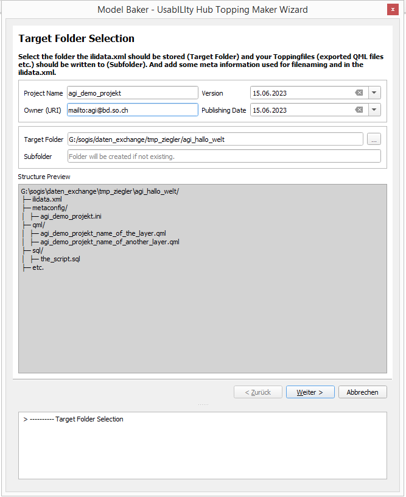

# Betriebs- und Nachführungshandbuch

## Einleitung
SO!GIS UsabILIty Hub ist eine Docker-Image und beinhaltet [QGIS Model Baker Konfigurationen](https://opengisch.github.io/QgisModelBaker/en/background_info/repositories/). Im Git-Repository werden die originalen / "lokalen" Usability Hub Exports verwaltet. Es sind Verzeichnisse mit einer _ilidata.xml_-Datei und weiteren Verzeichnissen. Zusätzlich hat es weitere notwendige Dateien. Aus dein einzelnen Usability Hub Exports wird in der Github Action Pipeline eine einzige _ilidata.xml_-Datei erstellt und die einzelnen _ilidata.xml_-Dateien werden nicht in das Image kopiert. Das Resultat ist technisch ein INTERLIS-Datenrepository mit sämtlichen QGIS Model Baker Konfigurationen (oder auch Model Baker Exporte).

Die _ilidata.xml_-Datei wird nach dem Erstellen mit _ilivalidator_ geprüft. Anschliessend wird das Image erstellt, ein Container gestartet und geprüft. Ist die Prüfung erfolgreich wird das Image nach Docker Hub und in die Github Registry deployed. Das Image wird viertelstündlich in der GDI deployed.


## Betrieb
```
docker run -p 8080:8080 sogis/usabilityhub
```

## Nachführung

### Struktur der Ablage
Der Aufbau der Ablage wie folgt aus:  

* ilihub
  - <Amtskürzel>_<Projekname> (Verzeichnis aus Model Baker Export)
  - ...

Der Model Baker Export muss in das Verzeichnis _ilihub_ kopiert werden. Der Verzeichnisname muss mit dem Amtskürzel beginnen. Dies wird von _ilivalidator_ geprüft. Ggf. muss der Constraint im [Quellcode](https://github.com/sogis/interlis-repository-creator/blob/master/src/main/resources/DatasetIdx16.ili) angepasst werden und das Plugin neu gebuildet werden.

Exportstruktur:




Falls man ein Model Baker Export nicht erstellen lässt, sondern z.B. den Ordner einfach kopiert, muss dafür gesorgt werden, dass die TID eindeutig ist (über sämtliche _ilidata.xml_-Dateien). Gleiches gilt für die `id` der einzelnen Objekte. 

Eventuell lohnt es sich auch das _.ilicache_-, _..ilimetaconfigcache_- und _.ilitoppingfilescache_-Verzeichnis in seinem Home-Directory zu löschen, wenn man neue Konfigurationen eingecheckt und deployed hat. Insbesondere wenn - gemäss Logfile - die Metakonfiguration nicht gefunden werden.

#### ilidata.xml
Die _ilidata.xml_-Datei wird von einem Gradle-Plugin, aus sämtlichen vorhandenen _ilidata.xml_-Dateien in den Unterverzeichnissen, erzeugt.

#### ilisite.xml
Im _ilisite.xml_-File sind sämtliche Metadaten zur vorliegenden Datenablage aufgeführt. Dieses File muss nur dann bearbeitet werden, wenn sich in den Metadaten der Datenablage etwas verändert hat. Es muss **nicht** bearbeitet werden, wenn neue Model Baker Konfigurationen.

#### ilimodels.xml
Das File _ilimodels.xml_ ist statisch und inhaltlich leer. Es ist vorhanden, damit keine Fehler/Warnungen in einem Serverlogfile erscheinen, weil die _ilitools_ davon ausgehen, dass es vorhanden ist.


## Testen und lokale Entwicklung
Lokal kann man mit folgendem Befehl das Repository testen und erweitern (Docker muss installiert sein):

```
./gradlew createIliDataXml buildImage startContainer checkUsabilityHub
```

> Der Task `startContainer` startet einen lokalen Server auf dem Port 8080, somit ist der lokale UsabilityHub unter [http://localhost:8080/](http://localhost:8080/) erreichbar.
> Der Task `checkUsabilityHub` ist sehr einfach. Er überprüft den Statuscode und ob ein Objekt-Tag vorhanden ist.

Mit

```
./gradlew stopContainer
```

wird der Container wieder runtergefahren.
